# Prerequisites

To be able to follow this formation you'll need a dedicated environment and a few tools.

You'll also need to know basic linux, network, shell, and docker skills.

## Virtual Machine

You can use a dedicated server, VM, VPS, ... from your favorite coud provider.

For the sake of simplicity we will use a local [Ubuntu Server VM](https://www.ubuntu.com/download/server) with [VirtualBox](https://www.virtualbox.org)

1. Download and install [VirtualBox](https://www.virtualbox.org)
2. Download an [Ubuntu Server](https://www.ubuntu.com/download/server) iso
3. Create a new VM in VirtualBox with at least 2GB of RAM and 30GB of disk

4. Start the VM and select the path of your Ubuntu ISO

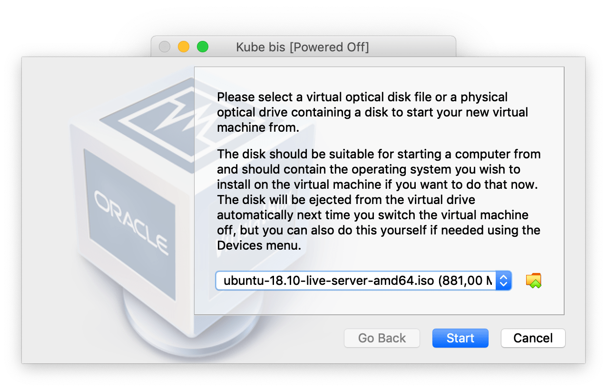

5. Proceed with the installation and reboot your VM

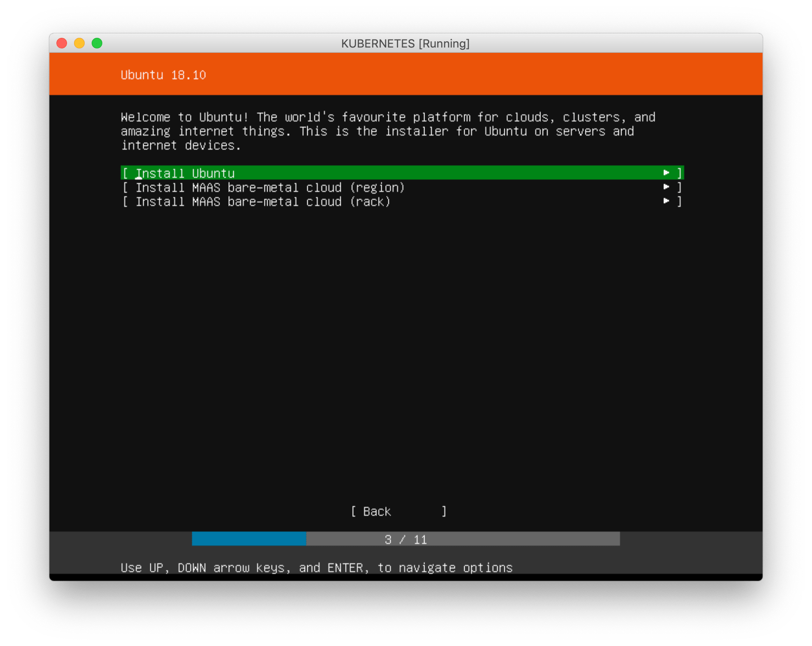
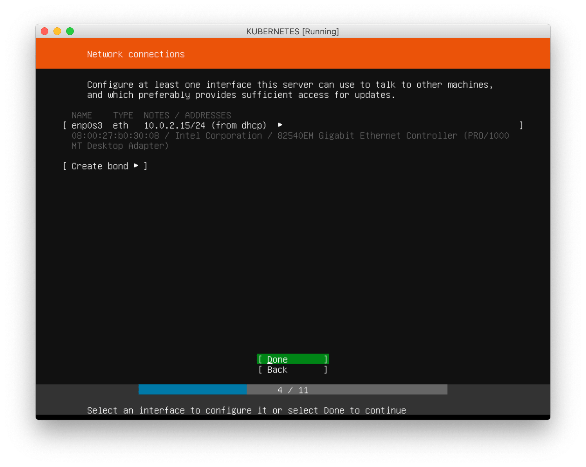
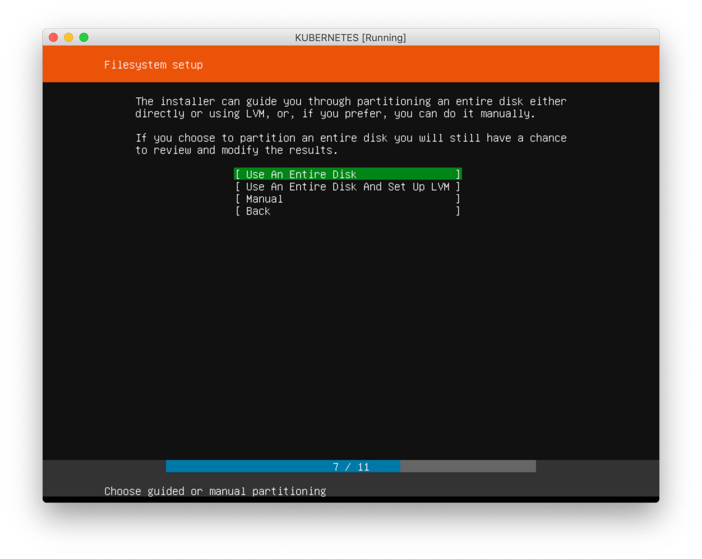
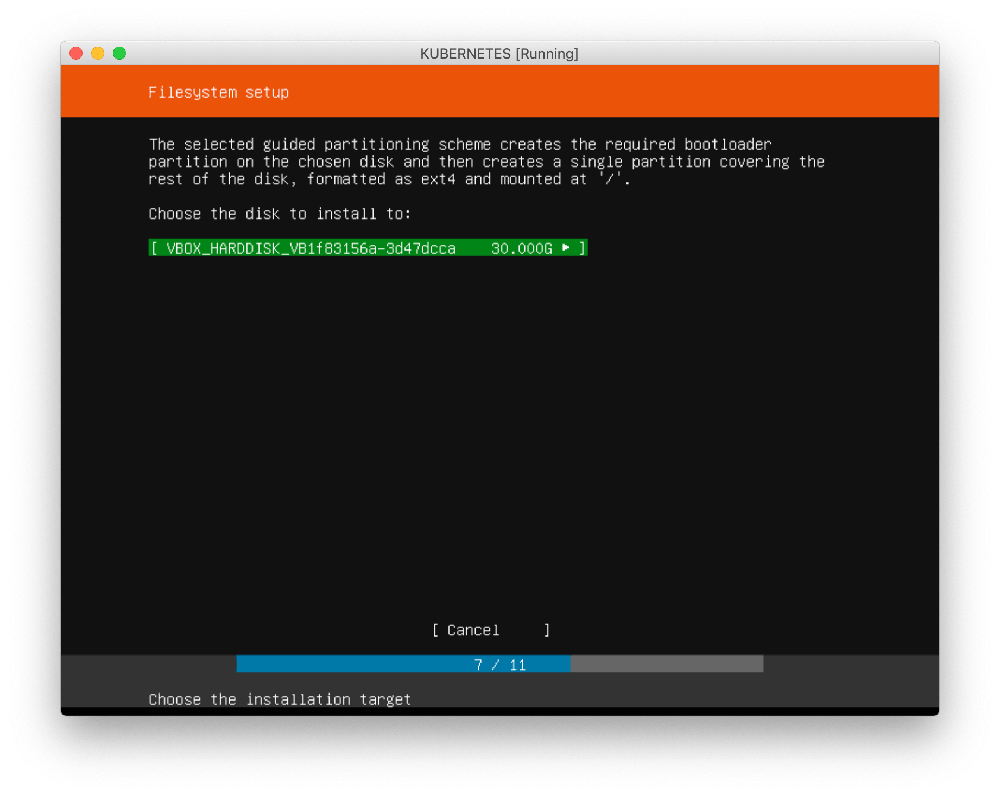
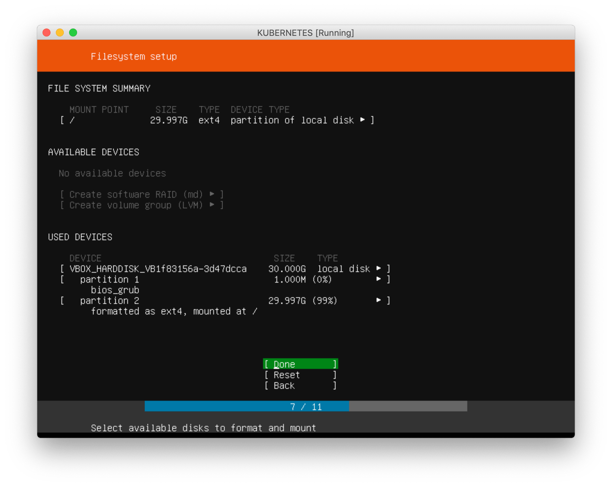
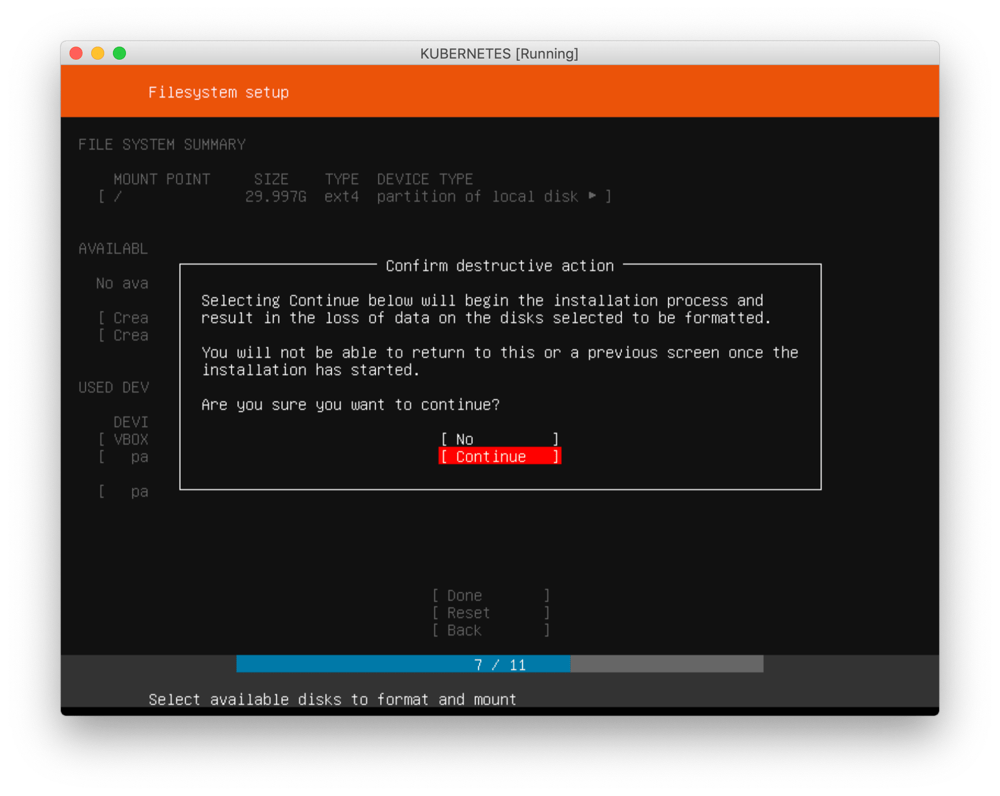
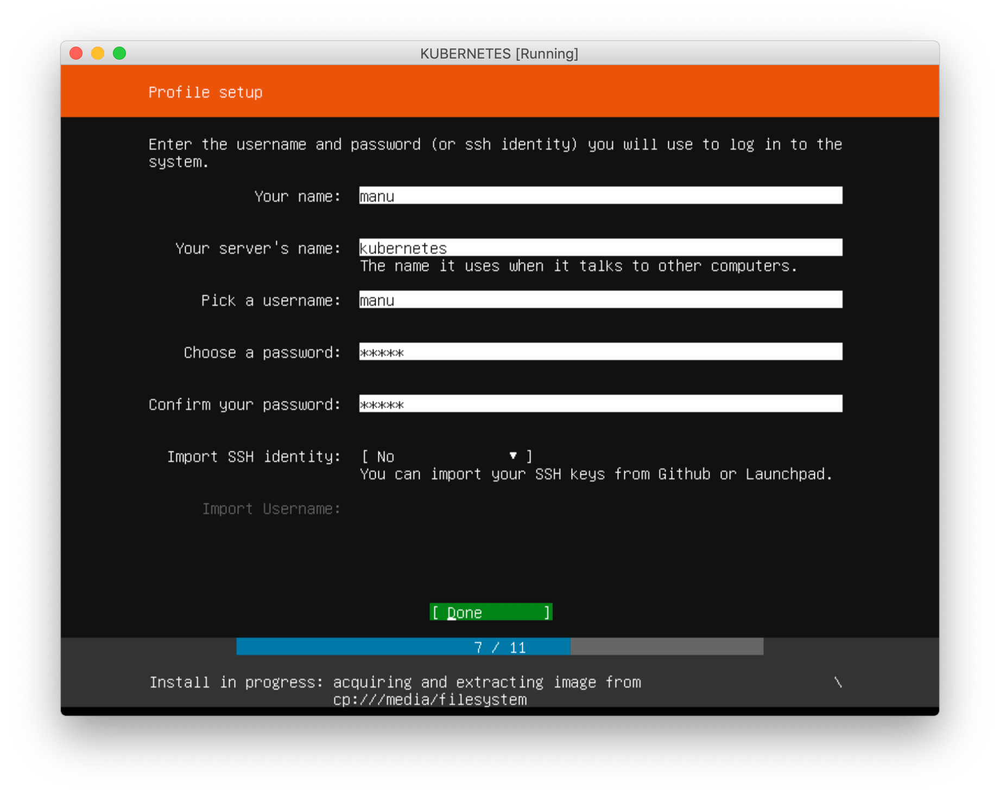
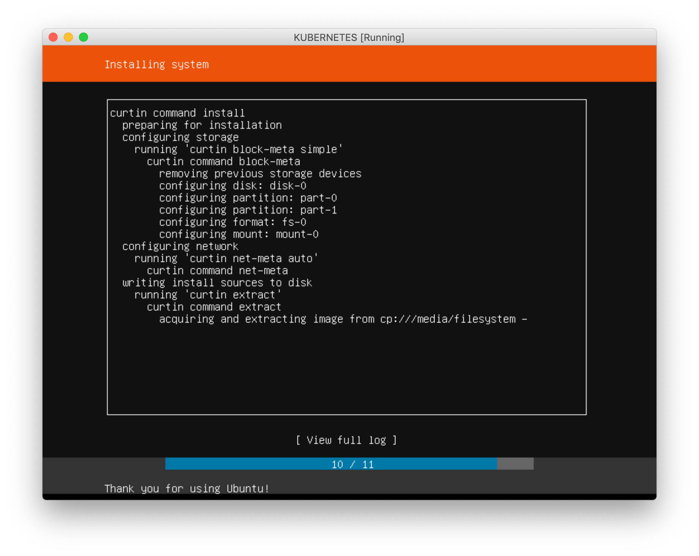
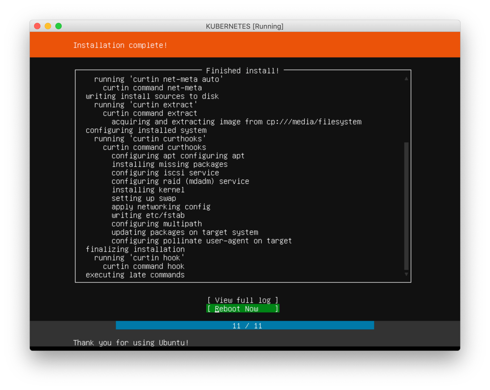

6. You should now have a fully functional ubuntu vm, you can log with the user you created

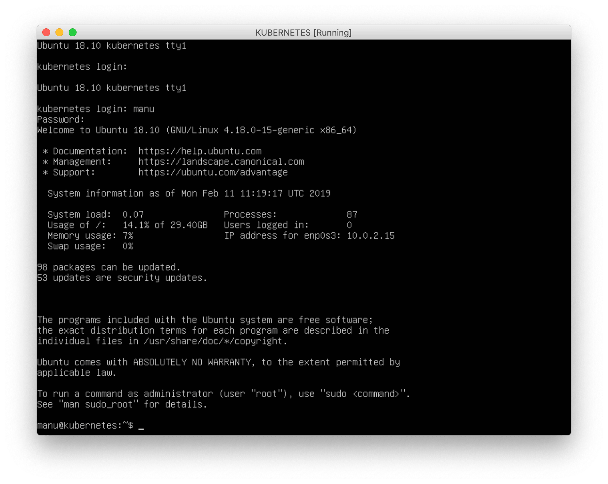

## Docker

## k8s toolchain
