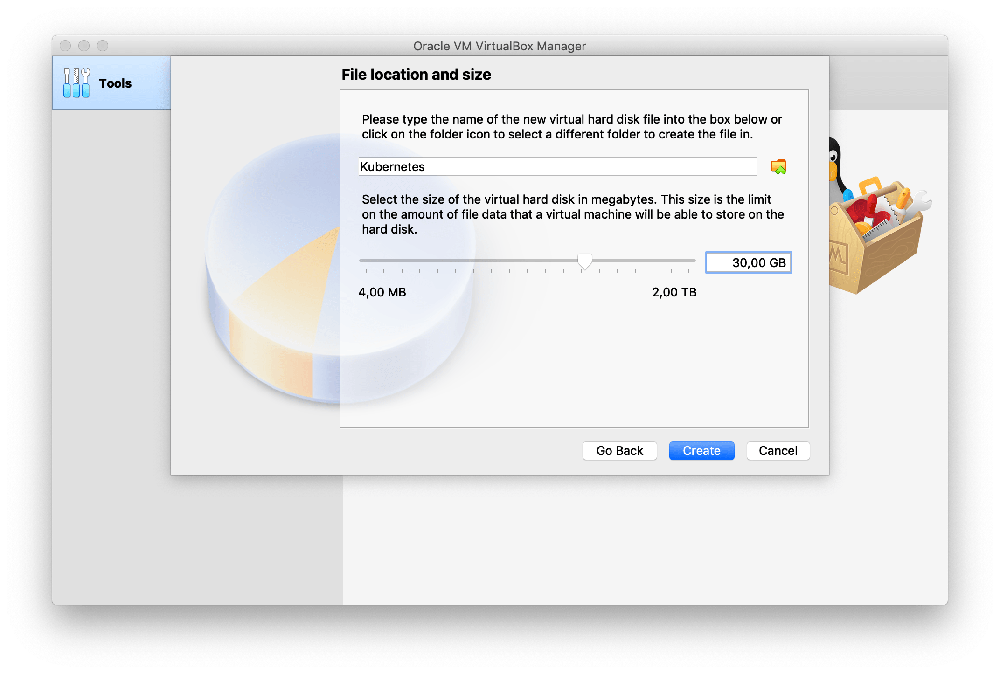

# Prerequisites

To be able to follow this formation you'll need a dedicated environment and a few tools.

You'll also need to know basic linux, network, shell, and docker skills.

## Virtual Machine

You can use a dedicated server, VM, VPS, ... from your favorite coud provider.

For the sake of simplicity we will use a local [Ubuntu Server VM](https://www.ubuntu.com/download/server) with [VirtualBox](https://www.virtualbox.org)

- Download and install [VirtualBox](https://www.virtualbox.org)
- Download an [Ubuntu Server](https://www.ubuntu.com/download/server) iso
- Create a new VM in VirtualBox with at least 2GB of RAM and 30GB of disk

    
    
    

